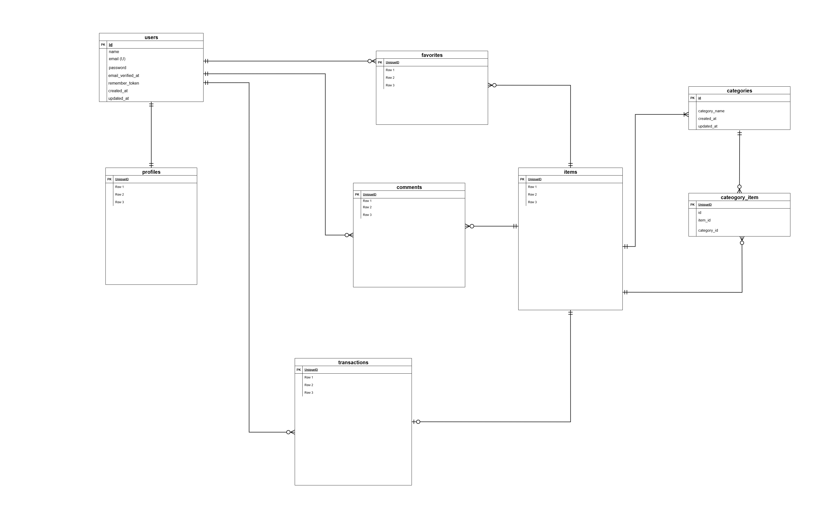

# アプリケーション名

coachtechフリマ

---

# 概要

以下の機能を実装したフリマアプリです

- ユーザー登録
- メール認証
- マイページ（出品/購入一覧表示）
- 商品一覧・検索・詳細表示
- 出品/購入機能
- stripe決済（コンビニ/クレカ払い)
- お気に入り（いいね）機能
- コメント機能

---

# 環境構築手順

### 1. Docker ビルド

```bash
# git clone (プロジェクトをcloneしたいディレクトリから実行)
git clone git@github.com:e-kasai/flea_market.git         # SSHの場合はこちら
git clone https://github.com/e-kasai/flea_market.git     # HTTPSの場合はこちら

# Docker立ち上げ
cd flea_market
docker compose up -d --build
```

### 2. Laravel 環境構築

```bash
docker compose exec php bash
composer install
```

### 3. 環境変数設定

- DB設定とMailHog設定は今回はローカルのみの為、既に入力済みです。
- APP_KEYとStripeキーは秘密情報にあたる為、リポジトリには含めていませんので作成をお願い致します。

```bash
# phpコンテナ内で引き続き実行
cp .env.example .env             # .env.example` をコピーして `.env` にリネーム
php artisan key:generate       # APP_KEYの作成
```

- Stripe設定
  [Stripe Dashboard](https://dashboard.stripe.com/test/apikeys) にログインし、「公開可能キー」と「シークレットキー」をコピーし.envに追記してください。

```php
# .envファイルを編集
STRIPE_KEY=       # pkより始まる各自の公開可能キー
STRIPE_SECRET=    # skより始まる各自のシークレットキー
```

### 4. シンボリックリンク追加

```bash
docker compose exec php bash  # phpコンテナから抜けた場合は再度入る
php artisan storage:link
```

### 5. マイグレーション、シーディングの実行

```bash
# 引き続きphpコンテナ内で実行
php artisan migrate
php artisan db:seed
```

### 6. テストの設定

```bash
docker compose exec php bash              # phpコンテナに入る
cp .env.testing.example .env.testing      # .env.testing.exampleをコピーして.env.testingを作成

php artisan key:generate --env=testing    # テスト用のアプリケーションキーを生成（空欄にしてあるため）
php artisan config:clear                  # 設定キャッシュをクリア


# テスト一括実行時は以下のコマンドをご使用ください
php artisan test

```

補足：
.env.testing.exampleにはStripeダミーキーを事前にいれてあります（テストでStripeClientが動かないエラー回避の為）
.env.testingにStripeキーの実際の値を設定する必要はありません

### 7. コード整形（任意）

本プロジェクトは Prettier を利用しています。
必須ではありませんが、次のコマンドで同じ整形ルールを適用できます。

```bash
npm install
npx prettier --write .
```

環境構築は以上です。

---

# 補足：環境について

### 1. 環境をクリーンに戻す必要が出たとき

- **DB をまっさらな状態** へ戻したい場合は下記コマンドを実行してください。 `db:seed` のみ再実行すると `insert` 方式のため重複レコードが発生します。

```bash
# phpコンテナ内から実行
docker compose exec php bash
php artisan migrate:fresh --seed
```

### 2. arm環境用の設定について

M1/M2 Mac など arm環境での互換性を考慮し、 主に MySQL 用に `platform: linux/x86_64` を指定しています。
必須ではありませんが、念のためMySQL以外のサービスにも指定しています。

---

# 使用技術

- Laravel 8.83.8
- PHP 8.1.33
- MySQL 8.0.26
- Docker/docker-compose
- MailHog v1.0.1
- Stripe
- JavaScript (ブラウザ実行)
- Node.js (Prettier 用)

---

# ER 図



---

# URL

- 開発環境：http://localhost/
- phpMyAdmin：http://localhost:8080/

---

## 開発用ログイン情報

Seeder により以下の10ユーザーが自動作成されます。

- 管理者ユーザー （メール認証済）
  - メール: admin_user@example.com

- 一般ユーザー（メール認証済）
  - メール: general_user@example.com

- ユーザー（メール未認証）
  - メール: userx@example.com (xには3～10のいずれかの数字を入れてください)

パスワードは全て"password"です。

---

# 補足：仕様について

## 1. Stripe決済

本アプリでは Stripe Checkout を利用し、クレジットカードおよびコンビニ決済を実装しています。
通常、コンビニ決済などの「非即時決済」では StripeのWebhookを受け取り、入金確定を待ってから購入を確定させるのが正しい実装です。

ただし今回の模擬案件では実際の入金処理は不要なことから、Webhookを省略しています。

#### 購入確定タイミング

- コンビニ払い
  - 購入ボタン押下で即 SOLD/DB確定
  - その後 Stripe の案内画面へ遷移（Webhook 未使用の簡易実装）
  - 戻り時のフラッシュは出さない想定
  - Stripeのコンビニ決済画面の左上にある”←”より戻り、ヘッダーロゴからトップページへ移動するとSOLD表示がされる

- クレカ払い
  - Stripe で決済 → `payment_status=paid` を確認してから SOLD/DB確定
  - 商品一覧ページにリダイレクトされフラッシュメッセージとSOLDが表示される

#### ダミーカード情報

クレジットカード払いの場合は以下のダミー情報を使用してください。

- カード番号：4242 4242 4242 4242
- 有効期限：12/34
- セキュリティコード：123
- 名前やメールアドレス：任意のもの

---

## 2. メール認証

このアプリは「新規ユーザー登録 → 認証メール受信 → 認証完了 → ログイン」という流れを前提にしています。

ただし、Seeder で作成されるダミーユーザーは登録処理を経ていないため、自動的に認証メールは送信されません。

ダミーユーザーでログインする場合は、以下のいずれかの方法で対応してください：

- 「認証メール再送」を行う
- 最初から認証済みの管理者アカウント `admin_user@example.com` を利用する

---

## 3. レスポンシブ対応の基準設定

将来的な保守性を考慮し最新スマホ幅を基準に最小サイズを設定しています

---

## 4. アップロードサイズ制限

本アプリでは商品画像などのアップロードを想定しているため、
Nginx / PHP のアップロードサイズ制限を 6MB に統一しています(validationの５MB＋１MBバッファ)

| チェック項目                  | コマンド / ファイル | 設定値 |
| ----------------------------- | ------------------- | ------ |
| Nginx の client_max_body_size | nginx.conf          | 6 MB   |
| PHP の upload_max_filesize    | php.ini             | 6 MB   |
| PHP の post_max_size          | php.ini             | 6 MB   |

---

## 5. 可読性向上 (Serviceクラスの使用)

- PurchaseController はフロー制御に専念させるため、
  Stripe 決済やトランザクション処理などのビジネスロジックは Service クラスに分離することで200行未満を実現しています。

- `App\Services\PaymentService`
  - Stripe API との通信を担当
  - Checkout セッションの作成、決済完了の取得など

- `App\Services\TransactionService`
  - DB への購入情報保存を担当
  - アイテムをロックし、購入済みに更新／トランザクションを記録する処理

---

## 6. セキュリティ設計

セキュリティ観点により、`buyer_id`と`seller_id`をfillableから除外しています

---

## 7. マイリスト機能の挙動

トップページ (`/`) では「おすすめ」と「マイリスト」をタブで切り替えて表示しています。

- **おすすめタブ**
  - ゲスト（未ログインユーザー）でも閲覧可

- **マイリストタブ**
  - ゲストの場合：「ログインが必要です」と表示
  - ログイン済みだがメール未認証の場合：「メール認証が必要です」と表示
  - ログイン済みかつ認証済みの場合のみ、いいねした商品一覧が表示

これにより、要件にある「未認証の場合マイリストは表示されない」を満たしています。

---

## 8. 新規登録とメール認証の設計について

要件には「新規会員登録後にメール認証をしないでログインを試みた場合は、メール認証誘導画面へ遷移する」とあります。

本実装では Fortify の標準仕様に従い、登録完了時に自動的にログインされます。
そのため「登録直後は未ログイン」という状態はありませんが、メール未認証ユーザーがアクセスすると
`verified` ミドルウェアにより `/email/verify`（認証誘導画面）へリダイレクトされます。

これにより要件にある「未認証時はメール認証誘導画面に遷移する」を満たしています。

---

## 9. 一部ルートの変更について

本実装では Laravel のルートモデルバインディングを利用するため、パラメータ名を `{item_id}` ではなく `{item}` としています。
これにより `Item $item` をコントローラーの引数として受け取り、自動で存在確認や404ハンドリングが行われます。
（Laravelの標準的な書き方であり、find()不要で安全に実装できるため、本案件でも採用しました）
