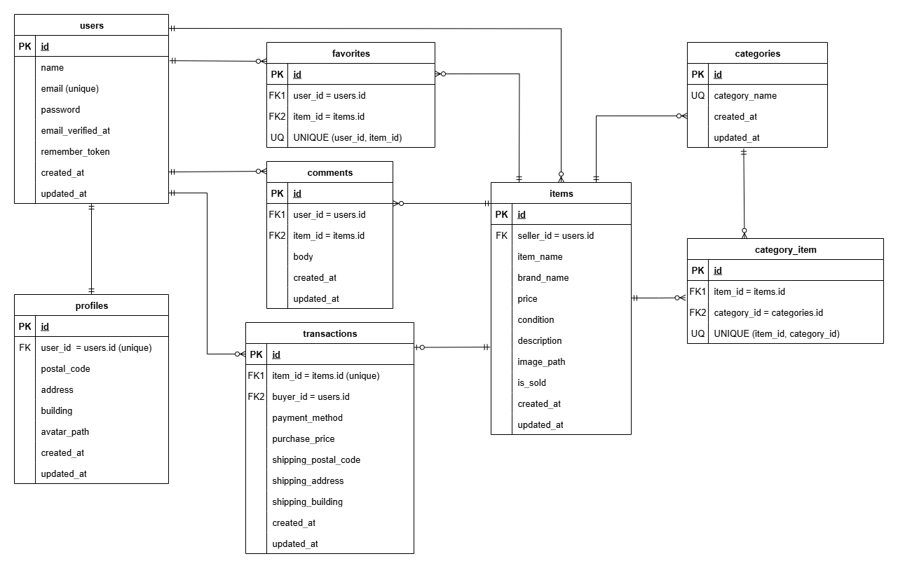

# アプリケーション名

## FleaMarket

Laravel × Stripe × Docker で構築したフリマアプリ（EC基礎を一通り実装）

---

# 概要

以下の機能を実装したフリマアプリです

- ユーザー登録
- メール認証
- マイページ（出品/購入一覧表示）
- 商品一覧・検索・詳細表示
- 出品/購入機能
- stripe決済（コンビニ/クレカ払い）
- お気に入り（いいね）機能
- コメント機能

---

# 環境構築手順

### 1. Docker ビルド

```bash
git clone git@github.com:e-kasai/flea_market.git         # SSHの場合
git clone https://github.com/e-kasai/flea_market.git     # HTTPSの場合

# Docker立ち上げ
cd flea_market
docker compose up -d --build
```

### 2. Laravelセットアップ

```bash
docker compose exec php bash
composer install
```

### 3. 環境変数設定（.env 作成）

```bash
cp .env.example .env
php artisan key:generate
```

### 4. Stripe 設定（必須）

Stripe Dashboard（テストモード）からキーを取得し `.env` に追加してください。

```php
STRIPE_KEY=       # pkより始まる各自の公開可能キー
STRIPE_SECRET=    # skより始まる各自のシークレットキー
```

### 5. ストレージリンク（画像保存用）

```bash
docker compose exec php php artisan storage:link
```

### 6. マイグレーション、シーディング

```bash
docker compose exec php php artisan migrate
docker compose exec php php artisan db:seed
```

### 7. テスト実行

```bash
docker compose exec php bash
php artisan test
```

---

# 補足：環境について

### 1. 環境をクリーンに戻す必要が出たとき

```bash
docker compose exec php bash
php artisan migrate:fresh --seed
```

---

# 使用技術

- Laravel 8.83.8
- PHP 8.1.33
- MySQL 8.0.26
- Docker/docker-compose
- MailHog v1.0.1
- Stripe
- JavaScript (ブラウザ実行)
- Node.js / npm（ビルド・整形ツール）

---

# ER 図



---

# URL

- 開発環境：http://localhost/
- phpMyAdmin：http://localhost:8080/

---

## 開発用ログイン情報

Seeder により以下の10ユーザーが自動作成されます。
※以下は開発用のダミーアカウントであり、本番環境とは無関係です。

- 管理者ユーザー （メール認証済）
  - メール: admin_user@example.com

- 一般ユーザー（メール認証済）
  - メール: general_user@example.com

- ユーザー（メール未認証）
  - メール: userx@example.com（x = 3〜10）

パスワードは全て"password"です。

---

# 補足：仕様について

## 1. Stripe決済

Stripe Checkout を利用し、クレジットカード決済・コンビニ決済に対応しています。<br>
開発環境では Webhook を使用せず、購入確定を簡易フローで処理する構成としています。<br>
テストカード番号（4242 4242 4242 4242）で動作確認できます。

---

## 2. メール認証

Fortify の標準仕様に基づき、メール認証を必須としています。<br>
Seeder で作成されるユーザーは開発用のため、メール認証済みとして登録されます。

---

## 3. レスポンシブ対応の基準設定

最新スマートフォンの画面幅を基準にし、スマホ・タブレット・PC の3段階でレイアウトを最適化しています。

---

## 4. アップロードサイズ制限

商品画像アップロードに対応するため、Nginx / PHP のアップロード上限を 6MB に統一しています。

---

## 5. 購入処理の責務分離（Serviceクラス）

Stripe 決済処理や購入確定処理は Service クラスに分離し、<br>
コントローラーはフロー制御に専念する構成としています。<br>
役割を分離することで保守性と可読性を向上しています。

---

## 6. セキュリティ設計

購入者／出品者のIDは不正更新を防ぐため `fillable` に含めず、<br>
コントローラー側で明示的に割り当てる設計としています。

---

## 7. マイリスト機能の挙動

ログイン状態とメール認証状態に応じて、<br>
「おすすめ／マイリスト」の表示内容を切り替えています。<br>
未認証ユーザーにはマイリストを非表示とすることで要件を満たしています。

---

## 8. ルート設計（ルートモデルバインディング）

Laravel のルートモデルバインディングを使用し、<br>
ルートパラメータを `{item}` に統一しています。<br>
`Item $item` を自動解決できるため、より安全で簡潔な実装になります。
